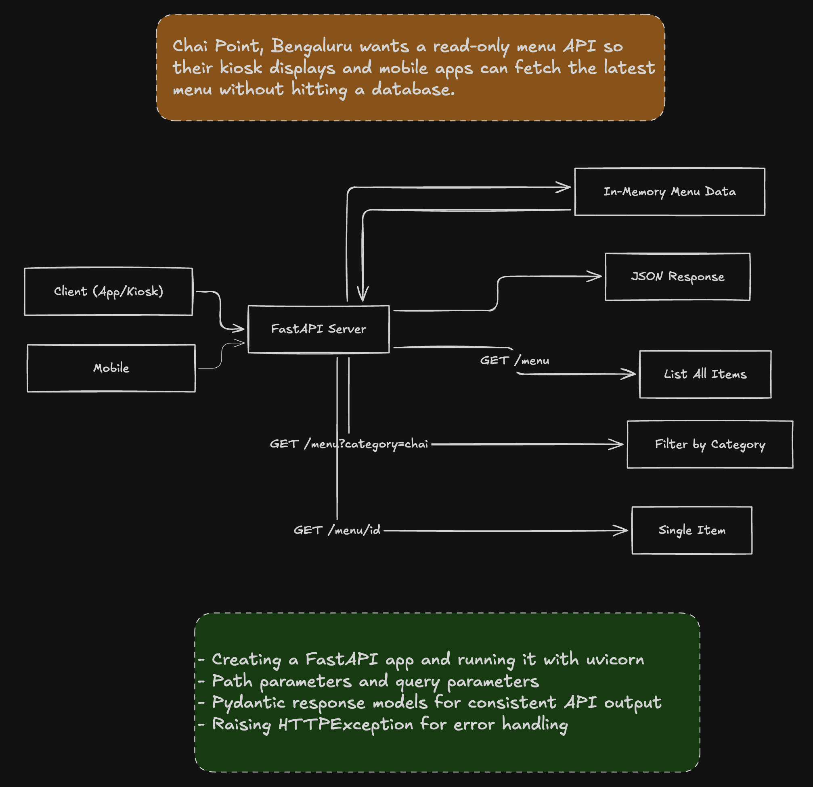

```bash

python3 -m venv venv

source venv/bin/activate

# Press cmd + shift + p in vs code and then type and click on select interpreter and then choose current dir that start with ./  

# Create requirement.txt file

# Install dependencies of requirement.txt file:
pip install -r requirement.txt

# Create main.py file

uvicorn main:app --reload # Run the fast api server
```

