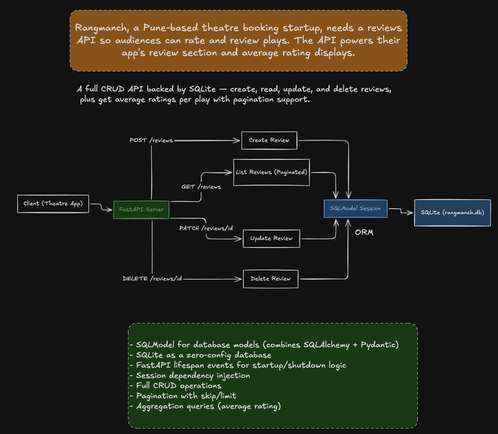

**Rangmanch, a pune-based theatre booking starup, needs a reviews API so audience can rate and review plays. The API powers their apps's review section and average rating displays.**

A full CRUD API backed by SQLite - create, read, update, and delete reviews, plus get averate ratings per play with pagination support.

- SQLModel for database models (combines SQLachemy + Pydantic)

-  SqLite as a zero-config database

- FastAPi lifespan events for startup/shutdown logic

-  Session dependency injection

-  Full CRUD operations

- Pagination with skip/limit
- Aggregation queries (average rating)

- SQLModel helps us to interact with any relational database from python code.
